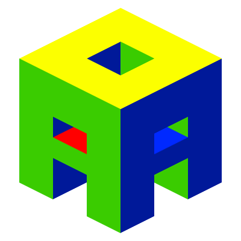

    
    <h1>alessio2122.github.io</h1>

    

        <h1 style="justify-content: center; margin-bottom: 1rem;">Lo que me interesa explicado a mi manera</h1>
        
        
¡Hola! Bienvenido/a a la página oficial de <strong>Alessio2122</strong> (yo).

        
Tecnología, programación, videojuegos y cualquier cosa que quiera contar estarán aquí. Bajo mis conocimientos, sin prisa.

    

